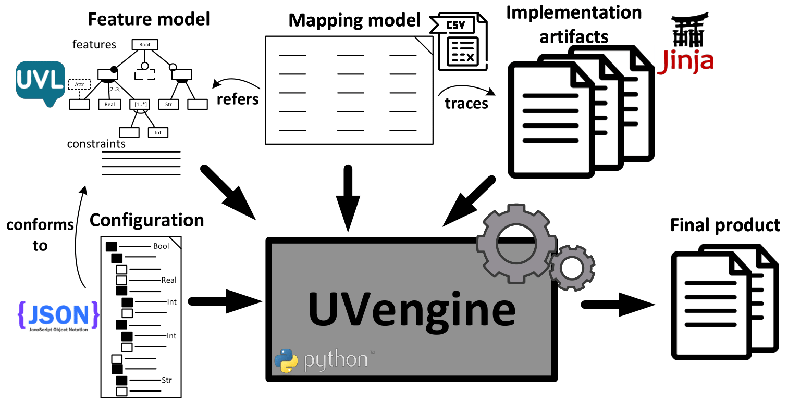

*UVengine* is a universal variability resolution engine for [UVL](https://universal-variability-language.github.io/) models and text-based artifacts with [Jinja templates](https://jinja.palletsprojects.com/en/stable/).

 

### Overview

Inputs and outputs of UVengine.

### Features

- A variability resolution engine for [UVL](https://universal-variability-language.github.io/) models.
- Support all [language level extensions of UVL](https://doi.org/10.1016/j.jss.2024.112326).
- Feature traceability between UVL models and implementation artifacts.
- Language independence for any text-based artifacts using [Jinja templates](https://jinja.palletsprojects.com/en/stable/).
- Composition and annotation-based mechanisms to implement variability at different degrees of granularity.
- Easy integration with existing tools of the [UVL ecosystem]() such as [UVLS](https://marketplace.visualstudio.com/items?itemName=caradhras.uvls-code) and [flamapy](https://www.flamapy.org/).

### Publications using the UVengine approach

- José Miguel Horcas, Mercedes Amor, Lidia Fuentes. *The Kubernetes variability model*. 19th International Working Conference on Variability Modelling of Software-Intensive Systems (VaMoS). 2025. DOI: <a href="https://doi.org/10.1145/3715340.3715440">https://doi.org/10.1145/3715340.3715440</a>
<button type="button" onclick="copyBibTeX(bibtexEntry4)">Copy BibTex 🗎</button>

- David Romero Organvidez, José Miguel Horcas, José A. Galindo, David Benavides. *Data visualization guidance using a software product line approach*. Journal of Systems and Software (JSS). 2024. DOI: <a href="https://doi.org/10.1016/j.jss.2024.112029">https://doi.org/10.1016/j.jss.2024.112029</a>
<button type="button" onclick="copyBibTeX(bibtexEntry3)">Copy BibTex 🗎</button>

- David Romero Organvidez, David Benavides, José Miguel Horcas, María Teresa Gómez López. *Variability in data transformation: towards data migration product lines*. 18th International Working Conference on Variability Modelling of Software-Intensive Systems (VaMoS). 2024. DOI: <a href="https://doi.org/10.1145/3634713.3634724">https://doi.org/10.1145/3634713.3634724</a>
<button type="button" onclick="copyBibTeX(bibtexEntry2)">Copy BibTex 🗎</button>

- José Miguel Horcas, José A. Galindo, David Benavides. *Variability in data visualization: a software product line approach*. 26th ACM International Systems and Software Product Line Conference (SPLC). 2022. DOI: <a href="https://doi.org/10.1145/3546932.3546993">https://doi.org/10.1145/3546932.3546993</a>
<button type="button" onclick="copyBibTeX(bibtexEntry1)">Copy BibTex 🗎</button>

### Entities involved

